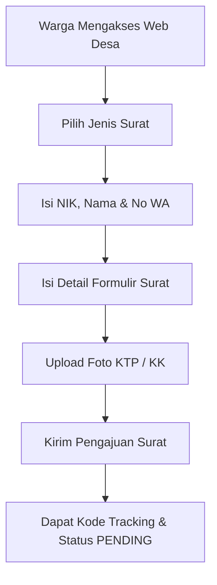
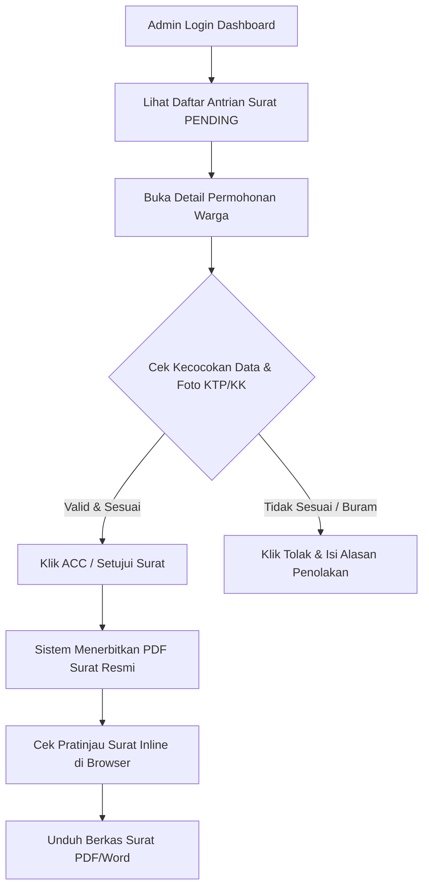

# 🏛️ Alur Kerja & Panduan Sistem Pelayanan Surat Digital Desa Klitih

Dokumen ini berisi penjelasan lengkap mengenai alur kerja sistem dari sudut pandang **Warga (User)** hingga **Perangkat Desa (Admin)**, termasuk fungsi verifikasi berkas syarat (KTP/KK) dan mekanisme penerbitan surat resmi.

---

## 📌 1. Gambaran Umum Sistem

**SIPAS (Sistem Pelayanan Surat Digital Desa Klitih)** adalah platform pelayanan publik berbasis web yang dirancang untuk mempermudah warga Desa Klitih, Kecamatan Plandaan, Kabupaten Jombang dalam mengajukan surat keterangan resmi kedinasan secara *online* langsung dari HP atau Laptop.

Sistem ini mendukung **12 Jenis Surat Resmi Desa**, antara lain:
1. Surat Keterangan Tidak Mampu (SKTM)
2. Surat Keterangan Kematian
3. Surat Keterangan Domisili
4. Surat Keterangan Usaha (SKU)
5. Surat Keterangan Belum Menikah
6. Surat Keterangan Kelahiran
7. Surat Keterangan Pindah Domisili
8. Surat Keterangan Penghasilan
9. Surat Keterangan Ahli Waris
10. Surat Pengantar Nikah (N1-N4)
11. Surat Keterangan Kepemilikan Tanah
12. Surat Pengantar SKCK

---

## 👤 2. Alur Pengajuan Surat oleh Warga (User Workflow)

### Langkah-Langkah Pengajuan Warga:
1. **Akses & Pemilihan Surat**:
   * Warga membuka situs desa dan memilih jenis surat yang dibutuhkan.
2. **Pengisian Data Identitas**:
   * Warga mengisikan **NIK (16 Digit)**, **Nama Lengkap**, dan **Nomor WhatsApp** yang aktif.
   * Warga melengkapi isian khusus sesuai jenis surat (misalnya: *Keperluan Surat*, *Nama Usaha*, *Tanggal Meninggal*, dll).
3. **Pengunggahan Berkas Syarat (KTP / KK)**:
   * Warga mengunggah foto Kartu Tanda Penduduk (KTP) atau Kartu Keluarga (KK).
   * 💡 **Fitur Otomatis HP**: Sistem dilengkapi kompresi otomatis di HP (*Client-Side Canvas Compression*). Foto kamera HP yang tadinya berukuran 12 MB akan dikompresi otomatis dalam 0.2 detik menjadi ~400 KB sehingga pengunggahan dari HP berjalan sangat cepat, hemat kuota, dan bebas error.
4. **Pengiriman & Pelacakan**:
   * Setelah dikirim, pengajuan masuk ke sistem dengan status `PENDING`. Warga menerima ID pengajuan untuk melacak status suratnya kapan saja melalui fitur **"Cek Status Surat"**.

---

## 🛡️ 3. Alasan & Fungsi Pengunggahan Berkas KTP / KK

Mengapa warga diwajibkan mengunggah foto KTP / KK saat mengajukan surat?

1. **Bukti Otentik Validasi Kependudukan**:
   * Foto KTP/KK berfungsi sebagai **bukti fisik bahwa pemohon benar-benar warga sah bertempat tinggal di Desa Klitih**, Kecamatan Plandaan, Kabupaten Jombang.
2. **Mencegah Penipuan & Permohonan Fiktif**:
   * Mencegah adanya oknum atau pihak luar yang menyalahgunakan NIK/Nama orang lain untuk membuat surat palsu tanpa sepengetahuan pemilik identitas.
3. **Bahan Verifikasi Bagi Admin Desa**:
   * Foto KTP/KK menjadi acuan utama bagi Perangkat Desa (Admin) untuk mencocokkan data pada formulir dengan dokumen kependudukan asli sebelum memberikan persetujuan (ACC).

---

## 👨‍💼 4. Alur Periksa & Verifikasi oleh Admin Desa (Admin Workflow)

### Langkah-Langkah Kerja Admin Desa:
1. **Masuk ke Dashboard Admin**:
   * Perangkat Desa masuk ke sistem admin (`/admin/dashboard`) dengan akun terotentikasi.
2. **Memeriksa Permohonan Masuk**:
   * Admin melihat daftar antrian permohonan surat warga yang berstatus `PENDING`.
3. **Verifikasi Berkas Syarat (KTP / KK)**:
   * Admin membuka detail surat dan memeriksa foto KTP/KK yang diunggah warga.
   * Admin mencocokkan NIK, Nama, serta keabsahan warga sebagai penduduk Desa Klitih.
4. **Pengambilan Keputusan (ACC / Tolak)**:
   * **Jika Data & Foto KTP/KK Sesuai (ACC)**:
     * Admin menekan tombol **"Setujui & Generate PDF Resmi"**.
     * Status berubah menjadi `APPROVED`.
     * Sistem secara otomatis menerbitkan dokumen resmi dengan Kop Surat Pemkab Jombang Desa Klitih, Logo Pemkab 1:1, serta Stempel Basah & Tanda Tangan Kades yang bertumpuk secara presisi di atas nama **Siti Ro'aini (Kepala Desa Klitih)**.
   * **Jika Data Tidak Sesuai / Foto KTP Buram (Tolak)**:
     * Admin menekan tombol **"Tolak Permohonan"**.
     * Admin memasukkan catatan alasan penolakan (misal: *"Foto KTP terpotong/buram, mohon upload foto KTP yang lebih jelas"*).
     * Status berubah menjadi `REJECTED`. Warga dapat membaca catatan penolakan ini dari HP mereka untuk memperbaiki pengajuannya.

---

## 👁️ 5. Fitur Pratinjau (Cek Surat Inline) Sebelum Diunduh

Untuk memastikan surat yang diterbitkan 100% tepat dan tidak ada kesalahan cetak:

1. **Tombol "Cek & Pratinjau Surat"**:
   * Tersedia di Dashboard Admin maupun di halaman detail surat.
2. **Visual Inline Preview (Tanpa Auto-Download)**:
   * Saat diklik, dokumen surat **langsung ditampilkan di layar browser (PDF Viewer)** di dalam modal interaktif.
   * **Tidak ada file yang terunduh otomatis** saat proses pemeriksaan.
3. **Konfirmasi & Pengunduhan**:
   * Admin/Warga dapat membaca dan memeriksa seluruh susunan tata letak surat.
   * Setelah dipastikan benar, centang persetujuan:  
     `☑ Saya sudah mengecek dan mengonfirmasi isi surat sudah benar`
   * Klik tombol **"Unduh Berkas Surat"** untuk menyimpan file PDF/Word ke laptop atau HP.

---

## 🌟 6. Keunggulan Teknis & Format Surat Resmi

* **Sesuai Format Kedinasan**: Menggunakan font *Times New Roman*, Kop Resmi Desa Klitih, garis separator kop tebal, tanpa garis tabel pembatas yang mengganggu, serta stempel bertumpuk di atas TTD.
* **Kompresi Gambar HP**: Upload berkas dari kamera HP berukuran besar (12MB) dikompresi otomatis menjadi ~400KB sehingga tidak menyebabkan server error di Vercel/Hosting.
* **Respon Cepat via WA**: Admin dapat langsung menghubungi WhatsApp warga dalam 1 klik dari dashboard admin untuk konfirmasi tambahan.

---

## 📑 7. Fitur Upload & Manajemen Template Surat (Admin Feature)

Sistem dilengkapi dengan **Fitur Manajemen Template Surat & Pengaturan Penandatangan** pada menu `/admin/dashboard/pengaturan`:

1. **Upload & Ganti Template Kustom (.docx / .pdf)**:
   * Perangkat Desa dapat mengunggah file format Word (`.docx`) atau PDF kustom untuk setiap jenis dari 12 jenis surat yang ada.
   * Ini memberikan fleksibilitas 100% jika Desa Klitih ingin menyesuaikan tata bahasa, pasal, atau format redaksi surat sesuai keputusan desa terbaru.
2. **Sistem Placeholder Otomatis (`{nama_lengkap}`, `{nik}`, dll)**:
   * Admin cukup menuliskan kode variabel di dalam file Word seperti:
     > *"Menerangkan bahwa warga bernama `{nama_lengkap}` NIK `{nik}` berdomisili di Desa Klitih..."*
   * Saat surat di-ACC dan diunduh, sistem secara otomatis mengganti variabel `{nama_lengkap}`, `{nik}`, `{keperluan}`, `{tanggal}`, `{nama_kades}`, dll dengan data riil warga secara instan.
3. **Pengaturan Identitas, TTD & Stempel Kades**:
   * Admin dapat memperbarui Nama & Jabatan Kepala Desa (misal: *Siti Ro'aini - Kepala Desa Klitih*).
   * Admin dapat mengunggah foto Tanda Tangan (`.png`) & Stempel Desa (`.png`) baru yang akan langsung dipasang bertumpuk otomatis pada setiap surat yang diterbitkan.

